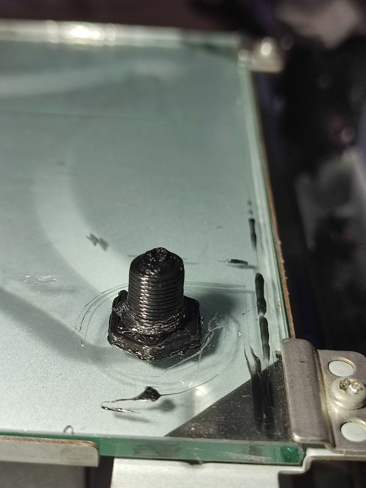
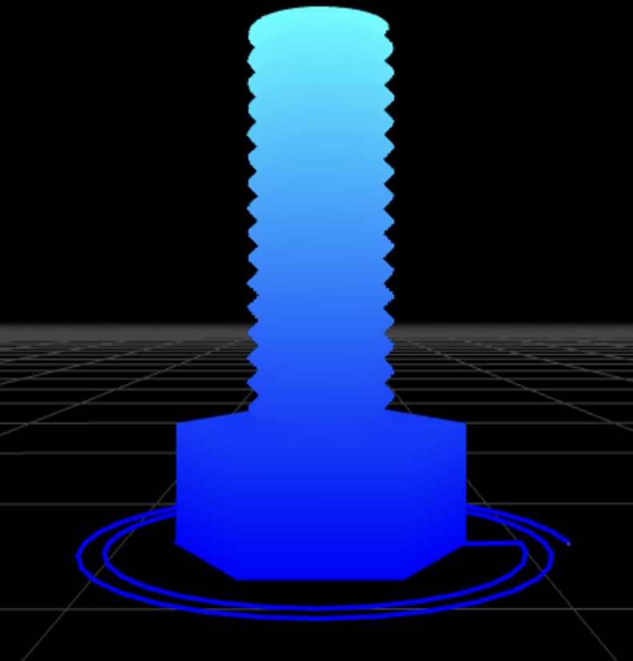
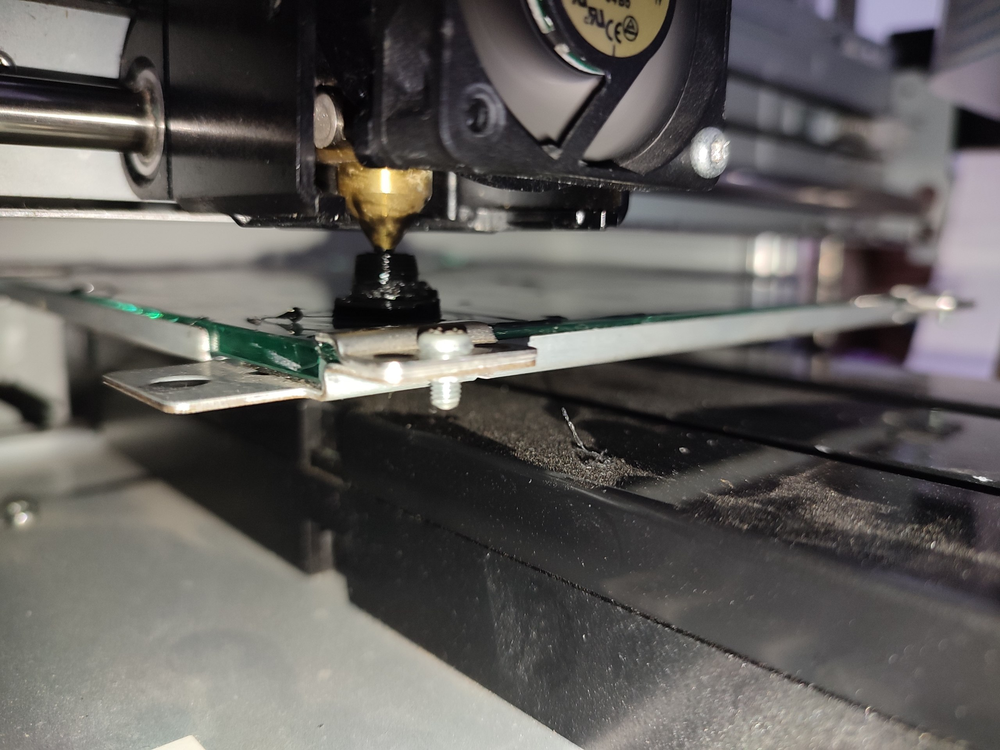
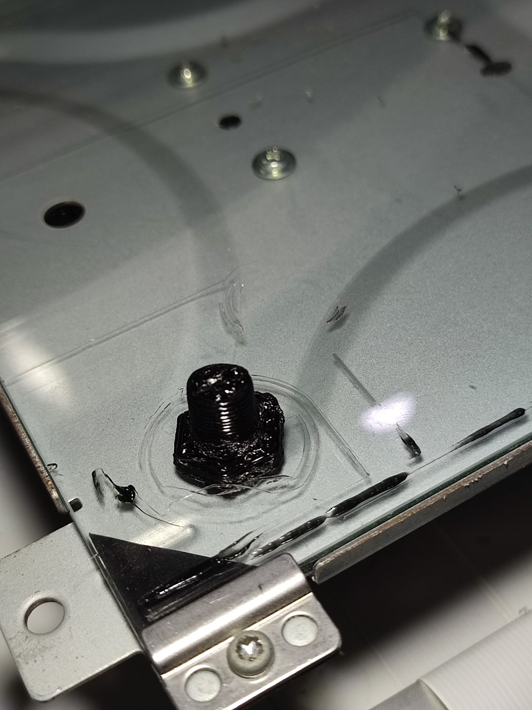
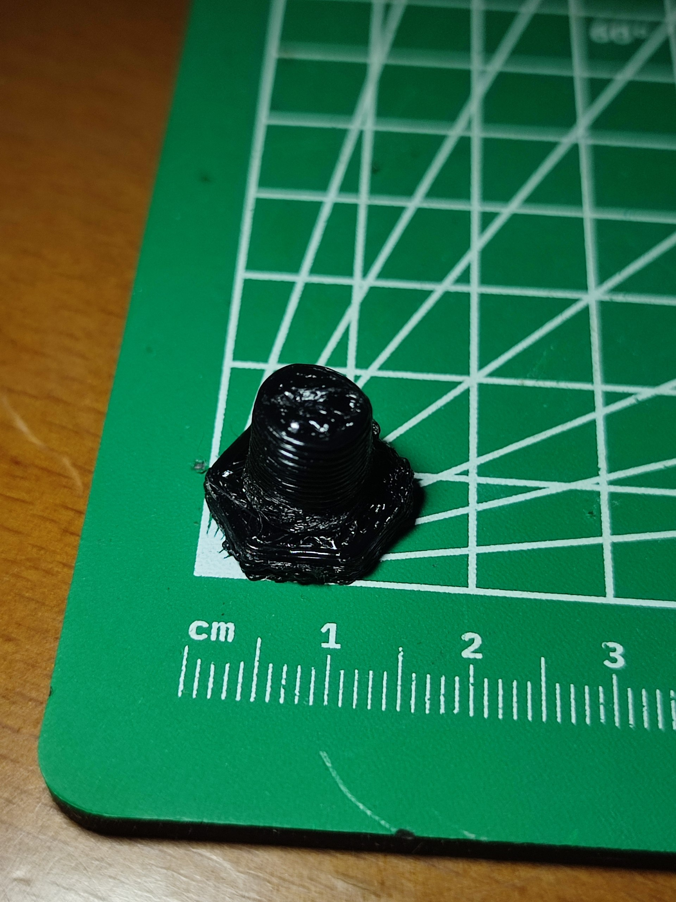

## Current progress

I have dumped the firmware of the 2. mpu, but i now need to trace all the pins and cables to the mpu's and connectors to be able to continue at all. the problem is, my multimeter is dead and im stuck unable to measure anything, aka not being able to continue at all.

Will continue when i figure out a way to power the multimeter.

Until then i will continue by fixing the broken links and update the docs.

### Update 26.08.2026 13:30 GMT+3:

I got a battery and now im back in business!
Going to trace the sub board first as it is the easiest to trace so far

### Update 26.08.2026 15:00 GMT+3:

I need a better way to note my pins. Having them spread out makes it A LOT harder to keep track of them.

I have decided to desolder the LCM since i cant trace cables under it easily. Ill probably end up breaking something but idonno

### Update 26.08.2026 18:45 GMT+3:

I have finished tracing the sub board and drawing the KiCAD schematic. I am tired and going to continue tonight/tomorrow.

### Update 27.08.2026 04:40 GMT+3:

I drew the hotend board and almost finished it, and started working on the main board drawings. At the same time im also cleaning up the repo structure. Its too lonely working like this but somehow i dont feel it

Tomorrow i will continue on working on the secondary MCU and its dumped firmware.

### Update 27.08.2026 14:30 GMT+3:

I will proceed by decompiling the secondary mcu firmware.

### Update 28.08.2026 18:54 GMT+3:

I decompiled the secondary mcu firmware, but im realizing i first need to have some idea on which pins might be for what functions.

### Update 31.08.2026 19:00 GMT+3:

I stopped decompiling work, and continued with pinout tracing. So far we have all the essential pins traced (including buttons/lcd/sd), but i want to trace everything before creating a schematic. The LPC MCU is also easily flashable via UART and SWD, which will make things easier.

### Update 31.08.2026 20:00 GMT+3:

Due to the split MCU design, klipper support looks hard without hardware modding. I will continue by searching about RRF instead.

### Update 31.08.2026 23:20 GMT+3:

I need to fork RRF since the dual mcu stuff, and write custom firmware for the LPC chip and manage it over uart.

### Update 01.09.2026 00:57 GMT+3:

Figured out there are fuses on the main board. There were 2 separate 12v lanes and i was confused. first one is unfused, goes to the motor drivers current sense pin? weird. Other one is fused, goes to motors. there is also a hotend heater fuse, but its separate.

There are 4 fuses so far from what i can tell. One for heater, one for reflow fan (maybe mine is popped?) one for motors inputs.

This fixed me being stuck about the schematics, as i did not know what was some of the main power lanes were connected to. Now i got a bigger problem about marking power lanes or drawing them all fully. ig ill end up drawing them all and only labeling the raw one as 12v.

Update: okay they are all fused, i was just blind. on a side note, all my fuses seem to be intact.

### Update 01.09.2026 22:00 GMT+3:

Its getting tiring to trace everything manually on the main board since its too big to keep track of, especially since the high amount of vias. I keep losing track of which pin goes where, especially power pins, which makes it look like stuff are getting power from some divine place or something, i cant find the source of the power. I will continue tracing by creating a serial firmware to poke at the pins. For now ill do something basic that prints the triggered pins to serial, in the future i can make some firmata style interface or a firmata fork for it if i need to.

### Update 02.09.2026 13:00 GMT+3:

I checked the klipper source, firmata source and RRF source and decided to take the klipper gpio and uart code, take their linker and compiling scripts, gut klipper specific stuff from them and implement firmata on it. It will take a while probably since im not too familiar with raw C toolchain and their flags.

### Update 05.09.2026 14:50 GMT+3:

For the last 2 days, I offloaded the firmware writing part to LLMs, and so far its going well. Firstly I wrote a python GUI for the host side, then used Claude to improve it a bit, then ChatGPT decided to optimize it (it was taking 3+ minutes to start and render all the pins, now its <2 seconds.).

Then GPT took my protocol description and wrote a C firmware for the printer side. I want to thank @henmalib for most of this here. Then again, thanks to @henmalib, GPT rewrote the firmware and the GUI in rust, and its a lot cleaner and faster. We also improved the GUI and the protocol a lot, fixed dropped packets and more. Currently GPT is working on a uart passthrough for lpc to sam chip so i can control both of them over 1 uart line with no soldering extra wires.

Currently I mapped almost all the pins for the sam4e8e (missing the flash chip and the buzzer, maybe some leds), waiting for the lpc to sam chip uart passthrough so I can map the rest. I mapped enough pins for an interactive control system (endstops, buttons, motors etc all mapped), mainly missing the hotend and LCD for the rest.

Later on, I will also add a ESP12 chip to the board so I can use the RRF webui.

### Update 06.09.2026 15:20 GMT+3:

I have traced a lot of the remaining pins thanks to the demo firmware. I have only the hotend chip left, 2 of the NFC pins, and some unused pins that i wonder what they do. I mapped the heater, all of the fans, and the flash chip.

### Update 08.09.2026 18:10 GMT+3:

I found some more pins connected between the lpc and sam chips, like the lpc reset pin etc. I think we can use this for future firmware updates, and we dont have to use a debugger for flashing anymore if it goes well.

I also cloned RRF in [RepRapFirmware-for-da-vinci-jr-1.0](https://github.com/itsyumiki/RepRapFirmware-for-da-vinci-jr-1.0) repo. Im planning on keeping it easy to use and maintain, and keep the documentation in this repo.

### Update 08.09.2026 21:15 GMT+3:

I am currently trying to create a proper build system for the firmware thats not eclipse. I do not want to add any heavy dependencies or tools to the build process.

### Update 09.09.2026 12:50 GMT+3:

I have realized I burned the back light of my lcd screen when i was desoldering it. I will order a new lcd screen, one with blue back light (i dont like the green ones).

Other than that, RRF builds successfully, can home all motors, can read the sd card. I still havent integrated it with the hotend, but it should be easy to do.

### Update 10.09.2026 00:50 GMT+3:

I concluded that the backlight is completely dead. Its a cob-ish led, and its impossible to fix it with the tools that I have. The screen itself is fine probably, but its almost unusable as it is.

I will order a new lcd screen, and while waiting for it, i will try to use the screen as it is.

### Update 10.09.2026 02:30 GMT+3:

I have realized RRF doesnt support 16x04 screens, and barely supports even the buttons. I will continue by working on hotend part for now, since screen and buttons will be a lot of work to implement.

Also I have verified that my screen works, but only the backlight is dead.

About the screen part: i will both try to find a screen thats 12864 while physically same or similar size to the current screen so that i can align it with the front panel, and i will try to implement 16x04 support to RRF. It might take a lot of extra work and a full ui redesign, which i plan to do.

### Update 10.09.2026 03:10 GMT+3:

My main plan currently is to get the printer enough to print properly. I will then continue with the remaining parts, unpopulated parts of the pcb etc.

About LPC: Since it handles the full heater and fans stuff, i plan to port those classes of RRF to the LPC, and stub those in the sam4e8e repo to call the other mcu over uart. I want to make something where sam tells lpc to go to a target temp and call back, not baby-sit every pin and pwm. This way i can also use the same tactic for klipper too.

The thermal trigger stuff are also important to think about, what happens when uart drops etc

Other than those, i also want to add a uart updater to the lpc firmware (i was able to find lpc's reset pin and the programming pin (this one is not fully verified) mapped to a sam gpio). This way, nobody else needs to have a SWD debugger to flash the lpc firmware.

My end goal in this repo is to have something where someone can just open the motherboard door, short the sw6 to erase sam4 firmware, flash the binaries from my releases and get a fully functional printer without any external tools or hardware. I want to make users have no hw/sw mods required to flash or use the firmware. It is also related to why i want to implement 1604 support to rrf, so nobody has to buy a separate screen.

I am also keeping full support for wifi, so anyone can populate the esp32-wroom location with a duet-flashed esp32 and use wifi. Poor man's jr 1.0w i guess.

### Update 10.09.2026 23:20 GMT+3:

I have added github issues for my timeline of plan. I plan to get gpt to implement most of them, with hardware testing between every step. In the meantime, i want to continue on mapping the extra pins etc from lpc but too lazy to

current stuff that i need to issue-ify:

- add uart update mechanism (need to first do the pinouts)
- new screen support and button nav support (can do anytime, but i wanna do it after new screen so its more comfortable)
- create proper calibration values (bed size, movement steps per mm, extruder steps per mm, heater and heating mass calibration stuff). i feel like i can extract most of these from decompiling the original firmware, which im also too lazy to do currently

i will probably pause this project for a few days because my hyperfocus melted away after the fun parts (tracing pins and stuff, tactile debugging) is done. its also why im delegating most of the firmware stuff to gpt, because i dont enjoy writing raw c or rust. i doubt my chances of continuing and finishing this project this summer unless i get some other people interested or contributing to it, which seems a bit unlikely due to the age of the device and stuff.

i will probably try starting one my new 200 new project ideas while ignoring the 10000 unfinished ideas

### Update 11.09.2026 19:25 GMT+3:

Big update. Thanks to @henmalib and gpt, we got the hotend working completely (heats up, measures, fan works). I am currently trying to get the extruder motor working (its a config issue, trying to define it as a toolhead). It might be possible to get it to print today or tomorrow. Currently the temps are very off (for example -5C for 25C, 18C for 40C) but i will fix that as soon as i get the extruder motor working.

### Update 12.09.2026 04:15 GMT+3:

I mapped the ESP32 (?) pinout, but i started doubting that its an ESP32. Most power pins are not populated, and the pinout makes almost no sense. It doesnt stop me from soldering in an ESP12 though.

### Update 12.09.2026 05:25 GMT+3:

I figured out the device is not an ESP32 but rather probably a GainSpan chip, like a GS2100MIE. There are some XYZPrinting specific manuals like [this one](https://www.cleancss.com/user-manuals/YOP/GS2100MIE). It has a "XYZ Printing 20140722" watermark and is marked preliminary confidential, but funny thing is neither companies dont exist anymore (sold and now dead)

### Update 12.09.2026 17:45 GMT+3:

I have traced even more pins, with only untraced pins being cam R/L (they go to U16, an unpopulated 6.5x6.5mm QFN 36 pin chip. Tracing doesnt help, as they dont connect to U2.) and BedNTC (i couldnt find which pin listens for it due to unpopulated resistor/capacitors near U2. I need to manually trace it, which seems hard and not necessary). I _could_ trace the U2 to U16, but it seems unnecessary for me at the moment.

Also i am bamboozled about the board having a Bed NTC port existing but no bed heater port.

I also traced unused and unpopulated pins like E2, 3D motor, Laser R/L, 3D led R/L, extra reflow fan and nfc pins not because i need them but rather that we can use those pins as general I/O pins. For example, 3D led port has 2 12V power and 2 3.3V signal lines available. Or the Laser ports has 1 3.3V signal per port, "TopHOME" port has 3.3V power and 3.3V signal available. We can add any extra hardware to these pins if needed.

Current firmware state is, i switched to figuring out the wifi chip connection since Duet is weirdly very dependent on it and using Pronterface or Octoprint to control it over USB is hard.

I also need to figure out how to update the LPC over SAM, and I plan to use the Duet's own firmware update way to do it. I thought about embedding the LPC firmware in SAM firmware as a payload, but that seems unnecessary and hard due to limited SAM flash space.

I also want to use the external 4MB onboard flash for something, but it RRF seem to just use the SD card for everything.

I am postponing the screen work once again, since if i can get the wifi working, i probably won't need it much. I will still try to work on it later if i feel like it though, since we can port marlin or klipper to this board.

### Update 14.09.2026 16:55 GMT+3:

It works! I got full controls working on it, including heater, fan, _extruder_, movement, SD card. My next step is to add wifi support so i can control it easier with duet wifi. I also need to fix and review a million things that GPT broke.

### Update 14.09.2026 19:42 GMT+3:

First print via RRF!

Its vertically compressed due to miscalibrated Z stepss per mm, which made it a LOT harder for me to calibrate the first layer, and took me way longer than it should. I first tried to print [this](https://fullcontrol.xyz/#/models/b70938) since i thought it would be a great demo for the first layer, but i didnt know the Z axis problem at first, so it came out as a blob. Second time, it had problem extruding and was way too close to bed. On my third try, i decided to print [this](https://fullcontrol.xyz/#/models/393a4c) (with star inner reinforcement) instead, which still started bad, and i gave up after it also became a blob. At this point i was very fraustrated, and felt like Z layer was not moving. I decided to change extrusion height from the default 0.15mm to 0.25mm, and it started a lot better. Extruder was still skipping and fighting for its life, but i managed to get a print even if it looks like it had a piano dropped on it.

| The print after its done                                   | How its supposed to look like                         |
| ---------------------------------------------------------- | ----------------------------------------------------- |
|  |  |

Here are some more images if you want to see:

| While still printing                               | Post-print in a bad angle                  | On a cutting board with cm                             |
| -------------------------------------------------- | ------------------------------------------ | ------------------------------------------------------ |
|  |  |  |

I used octoprint for it, and the printer was repeatedly crashing while trying to print.

There are a lot of active problems, but it can still print! If you want to tinker with it, its probably easy to fix, since most of the remaining problems are calibration and my skill issues. Though its still not printing as good as the original firmware, at least its printing freely!

### Update 17.09.2026 00:50 GMT+3:

I have decided to prioritize the WiFi again after getting my second print much better. Duet seems to be very WebUI centered, and it would be easier to setup WebUI and continue debugging that way instead of trying to use it over UART. Or i will first checkout the webui-on-pi way of duet and hope it works.

### Update 18.09.2026 18:25 GMT+3:

I released the first proper build, you can check it [here](https://github.com/itsyumiki/RepRapFirmware-for-da-vinci-jr-1.0/releases/tag/1.0.0).

Too tired to write the detailed flashing guide at the moment, ill just give a basic guide here:

Short the pads of the SW6 on the motherboard (next to the main MCU). Download the bins, connect printer to pc. Figure out the port. Use the Justfile to flash the main bin to the printer.

Then take an SD card, format as MBR, copy the `sys` folder from the repo into it(ill make a release of them too), then create a `firmware` folder, put the rest of the bins you downloaded to there (esp and lpc bins). Then extract the webui-sd zip to the sd card in a folder named `www`

Then put the sd card in, boot the device, run `M997 S3` to flash the lpc

If you want to use wifi, check out the [ESP12 pinout file](hardware/esp12-connection.md) and connect it that way. Ill also make a guide on this, as my notes are hard to read probably. [this file](clipboard-dump.md) might also help a bit, but you can just wait for the guide. Ill probably write it tonight at least.

Make sure to dump the firmwares and stuff. The flash chip is explicitly disabled and unselected in the firmware to prevent accidental overwriting.
